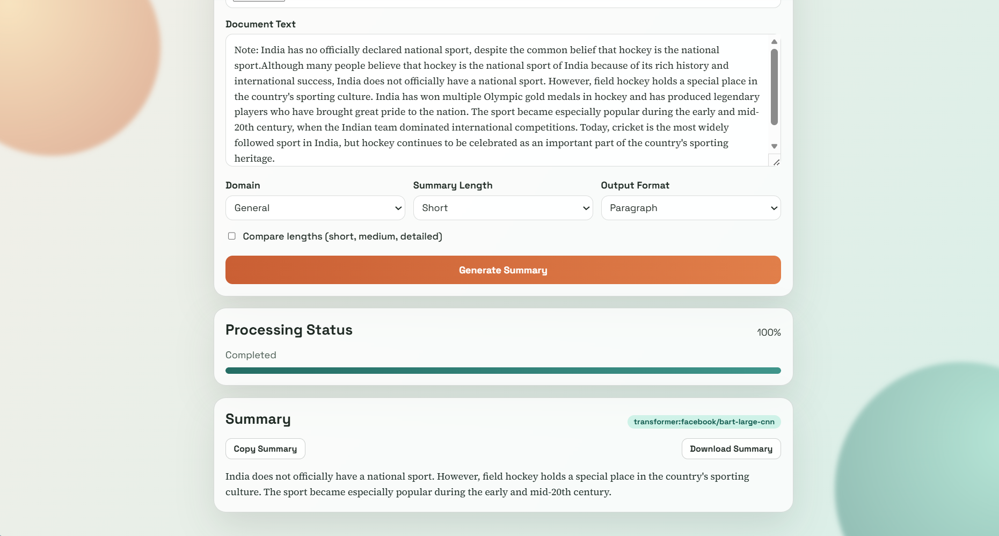
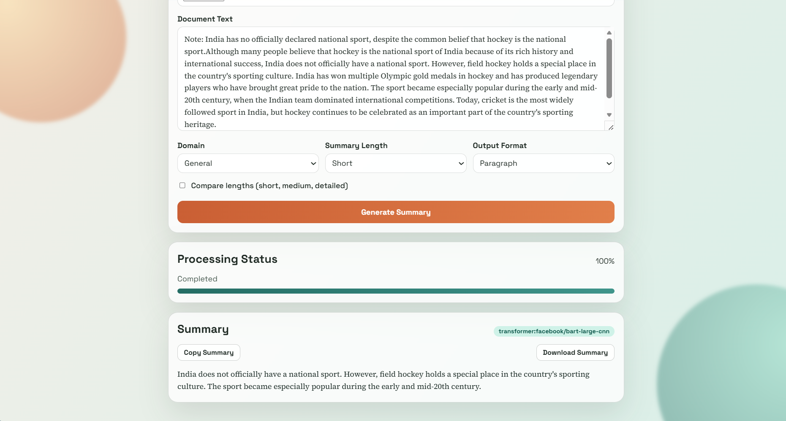

# Domain Text Summarization Tool (OpenAI, Groq, Gemini)

A Flask web app for summarizing long documents with:

- LLM-based summarization via OpenAI, Groq, or Gemini
- Domain-aware summarization prompts (general, legal, medical, finance, technical)
- Optional domain-specific model mapping per provider
- Transformer-based fallback summarization using Hugging Face pipelines

## Features

- Web UI for inputting long text and selecting domain
- File upload support for PDF, DOCX, and TXT
- Adjustable summary style: short, medium, detailed
- Compare lengths mode (generate short, medium, and detailed summaries together)
- Optional bullet-point summary format
- Automatic fallback to transformer summarization if provider call fails
- Provider priority routing with retry/backoff controls
- API protection with request size limits and rate limiting
- Real-time processing status with chunk progress updates
- One-click copy and download for generated summaries

## Project Structure

- `app.py`: Flask routes and web app entry point
- `summarizer.py`: OpenAI/Groq/Gemini + transformer summarization logic
- `templates/index.html`: Main page
- `static/style.css`: Styling
- `static/app.js`: Client-side form handling

## Setup

1. Create and activate a virtual environment.
2. Install dependencies:
   ```bash
   pip install -r requirements.txt
   ```
3. Copy `.env.example` to `.env` and configure:
   - `LLM_PROVIDER` as one of `openai`, `groq`, `gemini`
   - Matching API key for the selected provider
   - Optional domain model IDs for your provider
   - Optional routing/retry controls: `LLM_PROVIDER_PRIORITY`, `LLM_MAX_RETRIES`, `LLM_RETRY_BACKOFF_SECONDS`
   - Optional API safety controls: `MAX_CONTENT_LENGTH_BYTES`, `MAX_INPUT_CHARS`, `DEFAULT_RATE_LIMIT`, `SUMMARIZE_RATE_LIMIT`
4. Run the app:
   ```bash
   flask --app app run --debug
   ```
5. Open the URL printed in your terminal.

## Provider Configuration

Set `LLM_PROVIDER` in `.env`:

- `groq` to use Groq (free tier available)
- `gemini` to use Gemini (free tier available)
- `openai` to use OpenAI

Examples:

- Groq:
   - `GROQ_API_KEY`
   - `GROQ_MODEL=llama-3.1-8b-instant`
- Gemini:
   - `GEMINI_API_KEY`
   - `GEMINI_MODEL=gemini-1.5-flash`
- OpenAI:
   - `OPENAI_API_KEY`
   - `OPENAI_MODEL=gpt-4`

Optional domain overrides are available for each provider:

- `*_MODEL_LEGAL`
- `*_MODEL_MEDICAL`
- `*_MODEL_FINANCE`

The app automatically selects the matching domain model when set.

## Reliability and Safety

- Provider failover order can be configured using `LLM_PROVIDER_PRIORITY`.
- Each provider can be retried with exponential backoff controls.
- Requests are guarded by payload size limits and rate limits.
- Long-document transformer fallback uses chunked summarization to avoid model index errors.

## Running Tests

```bash
pytest -q
```

## API Endpoint

`POST /summarize`

Request JSON:

```json
{
  "text": "Long document text...",
  "domain": "general",
  "length": "medium",
  "format": "paragraph"
}
```

Response JSON:

```json
{
  "summary": "Concise summary text...",
   "engine": "groq:llama-3.1-8b-instant"
}
```

## Screenshots


